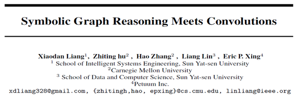

The last author of this paper is Eric P. Xing, which is my idol. And i have hounor to see him in Sanya early in this year. This paper is the newest work advanced by him and published on Neurips 2018.

## Symbolic Graph Reasoning Meets Convolutions
-----
