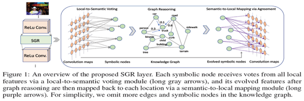

The last author of this paper is Eric P. Xing, which is my idol. And i have hounor to see him in Sanya early in this year. This paper is the newest work advanced by him and published on Neurips 2018.

## Symbolic Graph Reasoning Meets Convolutions
-----
The proposed method is illustrated below:

It is composed of three parts, we will dig out these components one by one.

### Local-to-Semantic Voting Module

#### Purpose:

Given local feature tensors from convolution layers, our target is to leverage global graph Reasoning to enhance local features with external structured knowledge.

#### How to do:

1. First summarize the global information encoded in local features into representations of Symbolic nodes.

This module aims to produce visual representations $ H^{p s} \in \mathbf{R}^{M \times D^{c}} $ of all symbolic nodes using $ X^{l} $, where $ D^{c} $ is the desired feature dimension for each node $ n $, which is formulated as the function $ \phi $ below:

$$ H^{p s}=\phi\left(A^{p s}, X^{l}, W^{p s}\right) $$

$ X^{l} \in \mathbf{R}^{H^{l} \times W^{l} \times D^{l}} $ represents the feature tensor after $ lth $ convolution layer as the module inputs, where $ H^{l} $ and $ W^{l} $ are height and weight of feature maps while $ D^{l} $ is the channel number.

$ W^{p s} \in \mathbf{R}^{D^{l} \times D^{c}} $ is the trainable transformation matrix for converting each local feature $ x_{i} \in X^{l} $ into the dimension $ D^{c} $.

$ A^{p s} \in \mathbf{R}^{H^{l} \times W^{l} \times M $ denotes the voting weights of all local features to each symbolic node.

More specifically, the function $ \phi $ is computed as follows:
