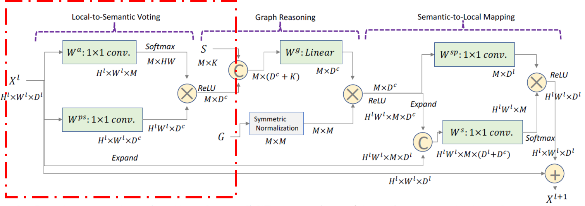
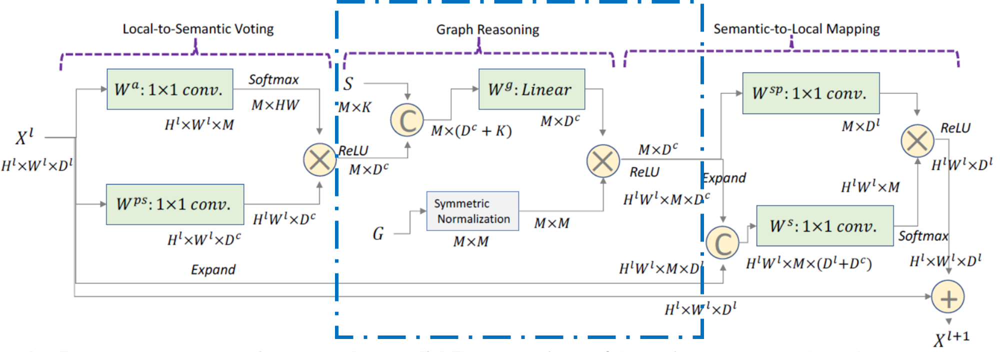

The last author of this paper is Eric P. Xing, which is my idol. And i have hounor to see him in Sanya early in this year. This paper is the newest work advanced by him and published on Neurips 2018.

## Symbolic Graph Reasoning Meets Convolutions
-----
The proposed method is illustrated below:

It is composed of three parts, we will dig out these components one by one.

### PART I: Local-to-Semantic Voting Module

#### Purpose:

Given local feature tensors from convolution layers, our target is to leverage global graph Reasoning to enhance local features with external structured knowledge.

#### How to do:

First summarize the global information encoded in local features into representations of Symbolic nodes. The procedure of this part is marked by green box below:

This module aims to produce visual representations $ H^{p s} \in \mathbf{R}^{M \times D^{c}} $ of all $ M = |\mathcal{N}| $ symbolic nodes using $ X^{l} $, where $ D^{c} $ is the desired feature dimension for each node $ n $, which is formulated as the function $ \phi $ below:

$$ H^{p s}=\phi\left(A^{p s}, X^{l}, W^{p s}\right) $$

$ X^{l} \in \mathbf{R}^{H^{l} \times W^{l} \times D^{l}} $ represents the feature tensor after $ lth $ convolution layer as the module inputs, where $ H^{l} $ and $ W^{l} $ are height and weight of feature maps while $ D^{l} $ is the channel number.

$ W^{p s} \in \mathbf{R}^{D^{l} \times D^{c}} $ is the trainable transformation matrix for converting each local feature $ x_{i} \in X^{l} $ into the dimension $ D^{c} $.

$ A^{p s} \in \mathbf{R}^{H^{l} \times W^{l} \times M} $ denotes the voting weights of all local features to each symbolic node.

More specifically, the function $ \phi $ is computed as follows:

$$ H_{n}^{p s}=\sum_{x_{i}} a_{x_{i} \rightarrow n} x_{i} W^{p s} $$

$$ a_{x_{i} \rightarrow n}=\frac{\exp \left(W_{n}^{a T} x_{i}\right)}{\sum_{n \in \mathcal{N}} \exp \left(W_{n}^{a T} x_{i}\right)} $$

Here $ W_{n}^{a} \in \mathbf{R}^{D^{l}} $ is a trainable weight matrix for calculating voting weights. It's convenient to know that $ a_{x_{i} \rightarrow n} \in \mathbf{R}^{1} $, when go through all of the local features $x_{i}$, where $ i=1,...,H \times W $, and all of the $ a_{x_{i} \rightarrow n} $ components the $ A^{p s}_{n} \in \mathbf{R}^{H \times W} $ (we omit upper label $ l $ for convenience) for the $ nth $ symbolic node.

Please note that $ W^{p s} $ is a global trainable parameter while $ W^{a} $ is a local trainable parameter which contains n components $ W^{a}_{n} $ tranversing all symbolic nodes.

*That's why in the last sentence of the section says "In this way, different local features can adaptively vote to representations of distinct symbolic nodes."*

### PART II: Graph Reasoning Module

#### Purpose:
Based on visual evidence of symbolic nodes, the reasoning guided by structured knowledge is employed to leverage semantic constraints from human commonsense to evolve global representations of symbolic nodes.

#### How to do:
We incorporate both linguistic embedding of each symbolic node and knowledge connections for performing graph reasoning. The procedure of this part is marked by blue box below:

Concretely speaking, for each symbolic node $ n \in \mathcal{N} $
